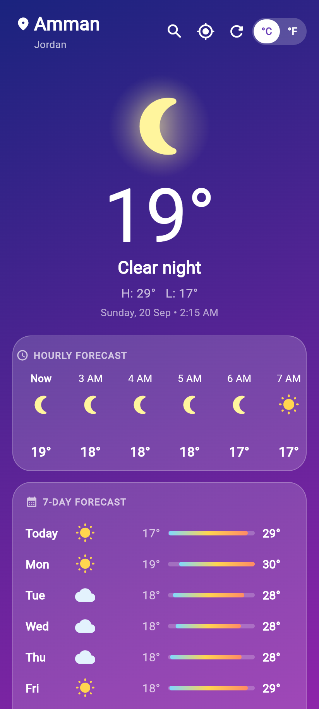
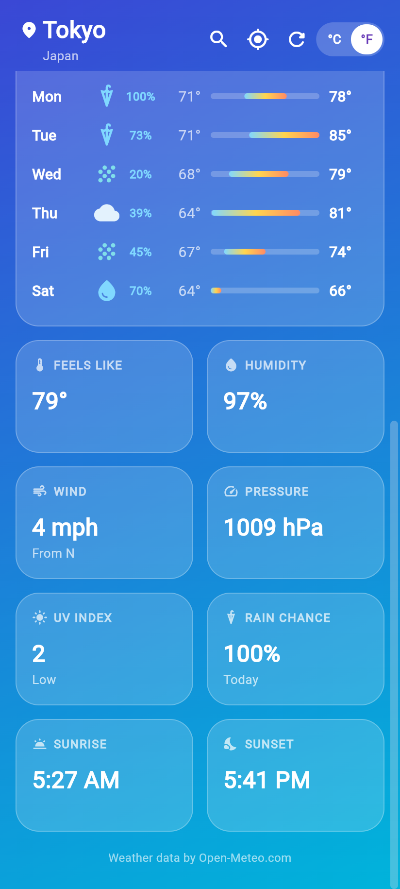
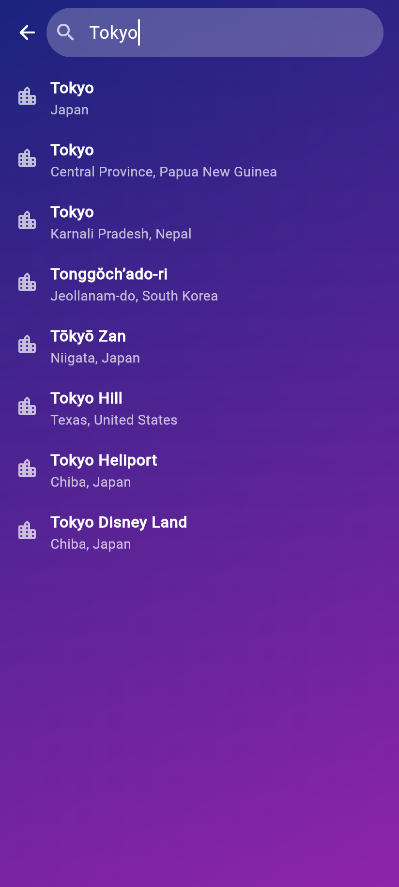
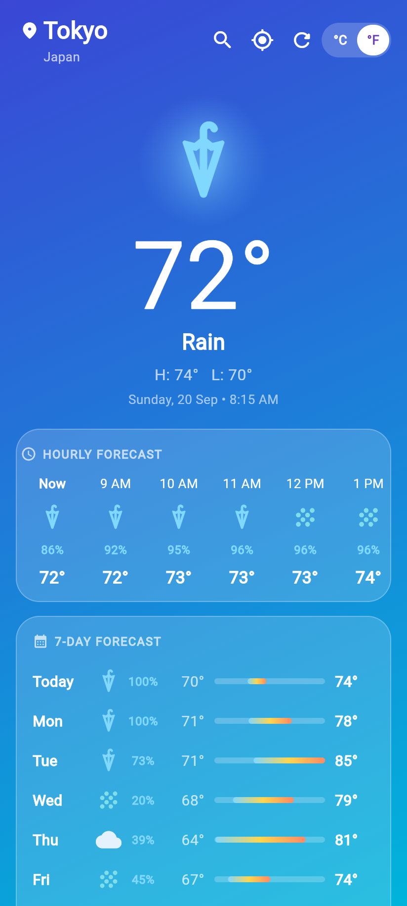
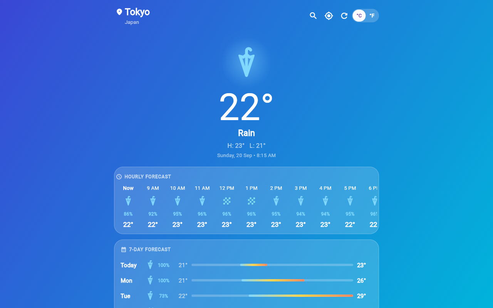
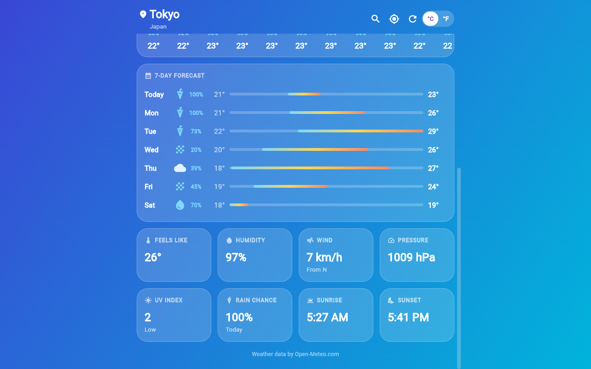

# Weatherly

A colorful, glass-style weather app built with **Flutter** for **Android** and **Web**. It uses the free, key-less [Open-Meteo](https://open-meteo.com) APIs, so there is nothing to sign up for and no API key to configure.

## Screenshots

| Home | Details | Search |
|:---:|:---:|:---:|
|  |  |  |

| Fahrenheit + rain theme |
|:---:|
|  |

**Desktop / wide web layout**




## Features

- Current conditions: temperature, "feels like", humidity, wind (speed and compass direction), pressure
- 24-hour hourly forecast with precipitation chance
- 7-day forecast with a temperature range bar per day
- UV index, rain chance, sunrise and sunset tiles
- Background gradient and icons that change with the weather and day/night
- City search (Open-Meteo geocoding) and a "My location" button (GPS / browser geolocation)
- °C / °F toggle
- Remembers your last city and unit between launches
- Pull to refresh, plus mouse drag-scrolling on web/desktop
- Responsive layout: 2-column tiles on phones, 4-column on wide screens

## Tech stack

| Purpose | Package |
|---|---|
| HTTP requests | `http` |
| Location | `geolocator` |
| Persistence | `shared_preferences` |
| Date formatting | `intl` |

Data sources: [Open-Meteo Forecast API](https://open-meteo.com/en/docs), [Open-Meteo Geocoding API](https://open-meteo.com/en/docs/geocoding-api), and BigDataCloud's free client reverse-geocoding endpoint (to name your GPS location).

## Project structure

```
lib/
├── main.dart                  # App entry, theme, scroll behavior
├── weather_controller.dart    # State (ChangeNotifier): city, data, units, errors
├── models/weather.dart        # City, WeatherData, HourlyPoint, DailyPoint
├── services/
│   ├── weather_service.dart   # Open-Meteo forecast, search, reverse geocoding
│   └── location_service.dart  # Permission handling + current position
├── screens/
│   ├── home_screen.dart       # Main UI
│   └── search_screen.dart     # City search
├── widgets/glass_card.dart    # Frosted-glass card
└── utils/
    ├── units.dart             # °C/°F, km/h/mph, compass, UV labels
    └── weather_style.dart     # Weather code -> icon, label, gradient
```

## Getting started

**Prerequisites:** [Flutter SDK](https://docs.flutter.dev/get-started/install) (Dart `^3.12.2`).

```bash
git clone <your-repo-url>
cd weather_app
flutter pub get
```

### Run

```bash
flutter run -d chrome     # Web
flutter run               # Android device / emulator
```

### Build

```bash
flutter build web --release     # output: build/web
flutter build apk --release     # output: build/app/outputs/flutter-apk
```

### Test and analyze

```bash
flutter analyze
flutter test
```

## Notes

- **Location on web:** browsers only allow geolocation on `https://` or `localhost`. If permission is denied or unavailable, the app falls back to Amman, Jordan (or your last saved city) and you can search for any city.
- **Android permissions:** `INTERNET`, `ACCESS_COARSE_LOCATION`, `ACCESS_FINE_LOCATION`.
- **App icons** are generated with `flutter_launcher_icons`:
  `dart run flutter_launcher_icons`

## Credits

Weather data by [Open-Meteo.com](https://open-meteo.com) (CC BY 4.0).
